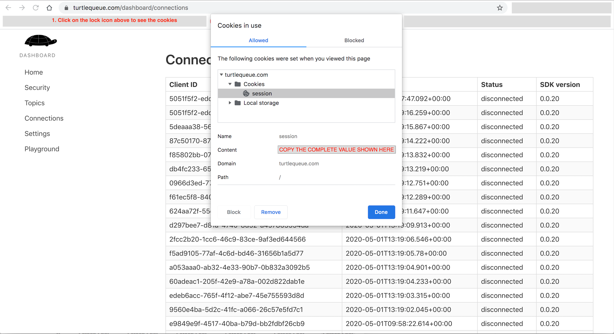

# Dashboard

This is the source for turtlequeue's dashboard. It is a TypeScript/React app, using GraphQL to fetch data.

## Available Scripts

### `yarn start`

Runs the app in the development mode. 
Open [http://localhost:3000](http://localhost:3000) to view it in the browser.

The page will reload if you make edits. 
You will also see any lint errors in the console.

### `yarn test`

Launches the test runner in the interactive watch mode. 
See the section about [running tests](https://facebook.github.io/create-react-app/docs/running-tests) for more information.

### `yarn build`

Builds the app for production to the `build` folder. 
It correctly bundles React in production mode and optimizes the build for the best performance.

## Local development credentials

In order to avoid running the server on your machine when developping, it is possible to reuse your exsiting credentials and the production infrastructure.

First, capture your credentials by logging in turtlequeue.com and then getting your session cookie value.
It must be a valid JWT token value (which can be pasted at jwt.io to check). See the screenshot below to see how it looks in Chrome:

Now edit the `.env.development` file, and fill the `REACT_APP_APOLLO_SESSION_COOKIE` variable with the previous session cookie value. This will allow you to run the dashboard locally, using real data from your account.

# Notes

When updating the DB schema, use apollo to download it again:

apollo schema:download --endpoint http://localhost:8001/v1/graphql
